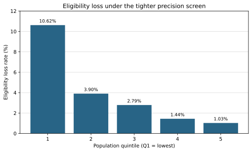
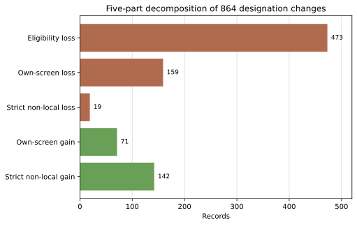

# Tables and figures: 2016 QCT precision-screen sensitivity

All values are generated from the registered 2016 HUD workbook. Counts refer to HUD records, not necessarily unique Census tract geographies. The strict screen is `MoE < c × estimate`.

## Table 1. Reconstruction and aggregate sensitivity

| Metric | `c=1.00` | `c=0.50` | Difference |
|---|---:|---:|---:|
| HUD records | 74,272 | 74,272 | 0 |
| Official-replay mismatches | — | 0 | — |
| Eligible records | 17,042 | 16,368 | −674 |
| Designated records | 14,057 | 13,619 | −438 |
| Binding allocation areas | 175 | 162 | −13 |

Derived rates: eligibility-loss rate 3.9549%; churn rate 6.1464%; net designation-rate change −3.1159%.

## Table 2. Five-part designation-churn decomposition

| Component | Operational definition | Records | Share of 864 |
|---|---|---:|---:|
| `L1` | Loss and ineligible at `c=0.50` | 473 | 54.75% |
| `L2` | Loss, remains eligible, own-screen vector changes | 159 | 18.40% |
| `L3` | Loss, remains eligible, own-screen vector unchanged | 19 | 2.20% |
| `G1` | Gain, own-screen vector changes | 71 | 8.22% |
| `G2` | Gain, own-screen vector unchanged | 142 | 16.44% |
| Total | Exact partition | 864 | 100.00% |

Strict non-local status changes are `L3 + G2 = 161`, occurring in 75 allocation areas across 31 state codes. The definition concerns the record's own six precision-pass indicators; all underlying data are fixed in both replays.

## Table 3. Eligibility loss by population quintile

Population quintiles are formed among the 17,042 records eligible at `c=1.00`.

| Quintile | Eligible at `c=1.00` | Losses | Loss rate |
|---|---:|---:|---:|
| Q1, lowest | 3,409 | 362 | 10.619% |
| Q2 | 3,409 | 133 | 3.901% |
| Q3 | 3,411 | 95 | 2.785% |
| Q4 | 3,405 | 49 | 1.439% |
| Q5, highest | 3,408 | 35 | 1.027% |

The standardized burden risk difference is 0.122396 (12.24 percentage points), standardized over eligibility type and substantive-threshold-distance quintile. It is descriptive, not causal.

## Table 4. Precision-screen pass counts across three releases

| Criterion | `c=1.00` pass count | `c=0.50` pass count | Newly rejected |
|---|---:|---:|---:|
| Income | 218,574 | 215,578 | 2,996 |
| Poverty | 208,988 | 118,854 | 90,134 |

Poverty requires positive numerator and denominator estimates and requires both to satisfy the strict precision inequality. Counts are release-level observations aggregated across the three ACS products.

## Figure 1. Eligibility loss by population quintile

Source: `outputs/determinism/run1/2016/population_quintiles.csv`. Generated by `scripts/05_build_manuscript_figures.py`.

## Figure 2. Five-part churn decomposition

Source: `outputs/determinism/run1/2016/annual_result.csv`. Generated by `scripts/05_build_manuscript_figures.py`.
